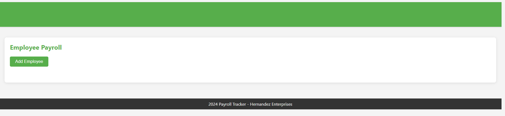

# < Module Challenge 03>

## Description

The purpose of this project was to modify starter code to create an application that enables a payroll manager to view and manage employee payroll data. This app will run in the browser and will feature dynamically updated HTML and CSS powered by JavaScript code that you write. It is now a clean and polished, responsive user interface that adapts to multiple screen sizes.

## Installation

NA

## Usage

Link to deployed website: https://nhl1090.github.io/Module-Challenge-1/

## Credits

Starter code was from The University of Texas at Austin Coding Bootcamp May class:

https://git.bootcampcontent.com/University-of-Texas-at-Austin/UTA-VIRT-FSF-PT-05-2024-U-LOLC

## License

License is in the repository.
